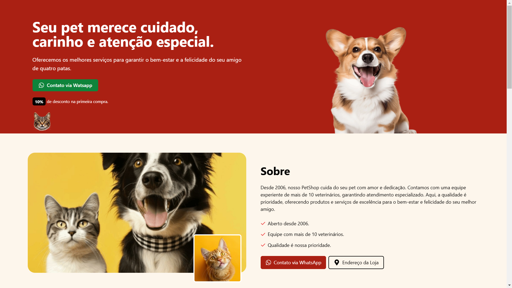
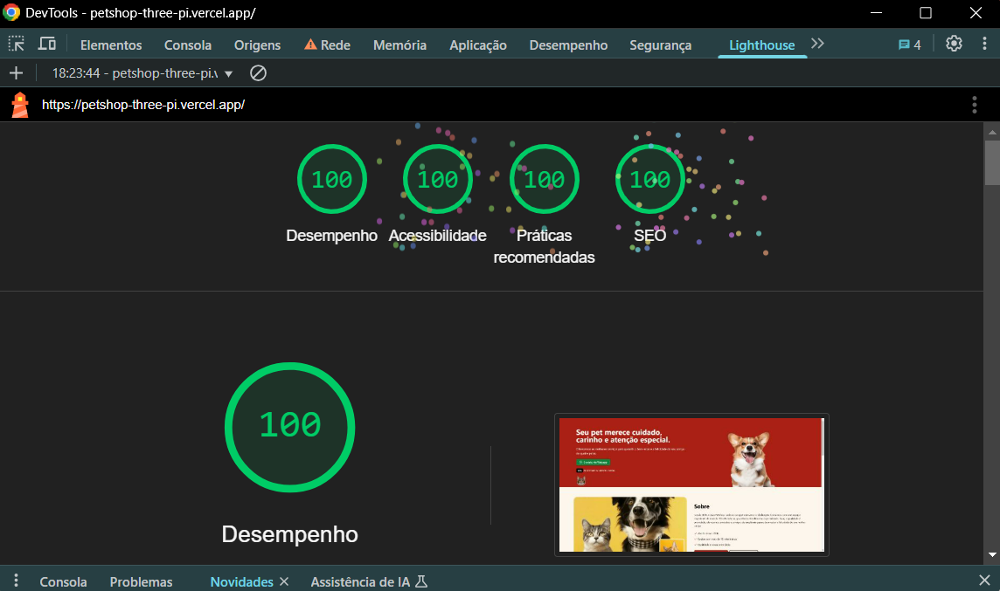

[TYPESCRIPT__BADGE]: https://img.shields.io/badge/TypeScript-007acc?logo=typescript&logoColor=fff
[NEXT__BADGE]: https://img.shields.io/badge/Next.js-black?logo=next.js&logoColor=white
[TAILWINDCSS__BADGE]:https://img.shields.io/badge/Tailwind%20CSS-%2338B2AC.svg?logo=tailwind-css&logoColor=white

[HTML__BADGE]: https://img.shields.io/badge/HTML-%23E34F26.svg?logo=html5&logoColor=white
[CSS__BADGE]: https://img.shields.io/badge/CSS-1572B6?logo=css3&logoColor=fff

[PROJECT__BADGE]: https://img.shields.io/badge/📱Visit_this_project-000?style=for-the-badge&logo=project
[PROJECT__URL]: https://petshop-arthurdias.vercel.app/

<h1 align="center" style="font-weight: bold;">PETSHOP 💻</h1>

<p align="center" style="color: #747474; font-size: 12px">
  landing page otimizada
</p>

![typescript][TYPESCRIPT__BADGE]
![Next.js][NEXT__BADGE]
![TailwindCSS][TAILWINDCSS__BADGE]
[](#)
![html][HTML__BADGE]
![css][CSS__BADGE]

<p align="center">
 <a href="#about">Sobre</a> • 
 <a href="#started">Primeiros Passos</a> • 
  <a href="#routes">Rotas</a> 
</p>


<p align="center">
    
    
</p>

<h2 id="about">📌 Sobre</h2>


Este projeto é uma simulação de uma landing page para um petshop, desenvolvida com foco mobile first e um design responsivo. O objetivo é oferecer uma experiência interativa e visualmente atrativa, permitindo que os usuários conheçam os serviços e produtos do petshop de forma intuitiva. A plataforma foi cuidadosamente otimizada para garantir um desempenho ágil e uma excelente performance em SEO, contribuindo para um carregamento rápido e uma melhor visibilidade nos mecanismos de busca.

[![visit this project][PROJECT__BADGE]][PROJECT__URL]


<h2 id="started">🚀 Primeiros Passos</h2>


Para executar este projeto localmente, siga as etapas abaixo. Certifique-se de ter o Node.js e o npm ou yarn instalados em sua máquina.

<h3>Pré-requisitos</h3>


- [NodeJS](https://nodejs.org/en)
- [Git](https://git-scm.com/downloads)

<h3>Clonando</h3>
Para clonar o projeto em sua maquina cexecute o código abaixo:

```bash
git clone https://github.com/ArthurDias26/Petshop.git
```

<h3>Começando</h3>

Após clonar o projeto abra um terminal e execute o código abaixo:

```bash
cd Petshop
npm install
npm start
```

<h2 id="routes">📍 Rotas</h2>


| rota               | descrição                                          
|----------------------|-----------------------------------------------------
| <kbd>/public/imagens</kbd>     | Pasta com as imagens e ícones utilizadas no projeto
| <kbd>/src/app</kbd>     | Pasta contendo todas as páginas do aplicativo roteadas usando Next App Router.
<kbd>/src/app/page.tsx</kbd>     | Arquivo / pagina principal da aplicação, onde os componentes são indexados
| <kbd>/src/app/_components</kbd>     | Pasta com todos os componentes utilizados na pagina home.
| <kbd>/src/components/ui</kbd>     | Pasta com todos os componentes importados do shadcn/ui.
| <kbd>/src/utilis</kbd>     | Pasta com funcionalidades adicionais da aplicação

